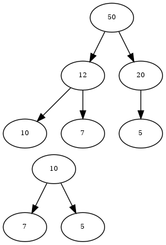

# 1 Quicksort ‒ theoretisch durchgespielt

## a)

Erster Durchgang:

12 10 52~1~ 9 77 23 18 52~2~ 11 25 8 5 _17_

12 10 5 9 8 11 _17_ 52~2~ 23 25 77 52~1~ 18

Zweiter Durchgang:

12 10 5 9 8 _11_ | 17 | 52~2~ 23 25 77 52~1~ _18_

8 10 5 9 _11_ 12 | 17 | _18_ 23 25 77 52~1~ 52~2~

Dritter Durchgang:

9 10 5 _9_ | 11 12 17 18 | 23 25 77 52~1~ _52~2~_

8 5 _9_ 10 | 11 12 17 18 | 23 25 52~1~ _52~2~_ 77

Vierter Durchgang:

8 _5_ | 9 10 11 12 17 18 | 23 25 _52~1~_ | 52~2~ 77

_5_ 8 | 9 10 11 12 17 18 | 23 25 _52~1~_ | 52~2~ 77

Fünfter Durchgang

5 8 9 10 11 12 17 18 | 23 _25_ | 52~1~ 52~2~ 77

5 8 9 10 11 12 17 18 23 _25_ 52~1~ 52~2~ 77

## b)

Die Zahl 52~1~ war nach dem ersten Durchgang rechts von 52~2~. Dass die
Reihenfolge im zweiten Durchgang noch einmal (und zwar endgültig) änderte, ist
reiner Zufall. Quicksort arbeitet _instabil_.

## c)

Beim ersten Durchgang kämen 12 (Index 0), 18 (Index 6) und 17 (Index 12) in
Frage. Dadurch würde erneut 17 als Trennelement fungieren.

Beim zweiten Durchgang würde es links wiederum genau gleich ablaufen, rechts
würde aber mit 25 ein anderes Element verwendet werden. Das könnte die
Sortierung etwas beschleunigen und evtl. einen fünften Durchgang ersparen.

# 2 Quicksort ‒ klassisch programmiert

## a)

```java
public static void quickSort(Character[] data, int left, int right) {
    int up = left;
    int down = right - 1;
    char t = data[right];
    do {
        while (data[up] < t) {
            up++;
        }
        while (data[down] >= t && down > up) {
            down--;
        }
        if (up >= down) {
            break;
        }
        swap(data, up, down);
    } while (true);
    swap(data, up, right);
    if (left < up - 1) {
        quickSort(data, left, up - 1);
    }
    if (right > up + 1) {
        quickSort(data, up + 1, right);
    }
}
```

Testfall:

```java
@Test
public void testQuickSort() {
    final int n = 200_000;
    Character data[] = SortingUtils.generateRandomCharArray(n, 'A', 'Z');
    Sort.quickSort(data, 0, data.length - 1);
    boolean sorted = SortingUtils.isSorted(Arrays.asList(data), true);
    Assert.assertTrue(sorted);
}
```

## b)

```java
public static void quickSort(Character[] data) {
    quickSort(data, 0, data.length - 1);
}
```

## c)

```java
public static Character[] randomChars(int size, int min, int max) {
    Random random = new Random(System.currentTimeMillis());
    Character array[] = new Character[size];
    for (int i = 0; i < size; i++) {
        array[i] = (char) (random.nextInt(max - min + 1) + min);
    }
    return array;
}
```

## d)

 Elemente (`n`)   Messung (ms)
---------------  ------------- 
          1000           2
          5000           7
        10'000          12
        50'000          35
       100'000         133
       500'000        2993
     1'000'000      11'888


Beispiel: Um welchen Faktor müsste eine Sortierung mit 1'000'000 Elementen
länger dauern als eine Sortierung mit 500'000 bzw. 100'000 Elementen?

    (1'000'000 * log 1'000'000) / (500'000 * log 500'000) = 2.1
    (1'000'000 * log 1'000'000) / (100'000 * log 100'000) = 12

Realität:

    11'888 / 2993 = 3.97
    11'888 / 133 = 89.4

Das Laufzeitverhalten scheint eher `O(n²)` zu entsprechen (eine Verdoppelung der
Elemente führt zu einer Verfierfachung der Laufzeit; eine Verzehnfachung der
Elemente erhöht die Laufzeit ca. um Faktor 90).

# 3 Quick-Insertion-Sort

## a)

Zur eigentlichen Methode, die zusätzlich einen Parameter `m` hat (Schwellenwert,
unter dem der Insertion-Sort verwendet werden soll), implementiere ich wiederum
eine Hilfsmethode.

```java
public static void quickInsertionSort(Character[] data, int m) {
    quickInsertionSort(data, 0, data.length - 1, m);
}

static void quickInsertionSort(Character[] data, int l, int r, int m) {
    // bestehender Algorithmus
    // ...
    // veränderte Rekursionsanweisung
    if (left < up - 1) {
        int from = left;
        int to = up - 1;
        if (to - from > m) {
            quickInsertionSort(data, from, to, m);
        } else {
            SimpleSorting.insertionSort(data, from, to);
        }
    }
    if (right > up + 1) {
        int from = up + 1;
        int to = right;
        if (to - from > m) {
            quickInsertionSort(data, from, to, m);
        } else {
            SimpleSorting.insertionSort(data, from, to);
        }
    }
}
```

## b)

Ich sortiere eine Million Zeichen mit verschiedenen `m`-Werten. Dabei erhalte
ich folgende Laufzeiten:

    m     Zeit (ms)
-----    ----------
    5       9420
   10       9278
   15       9259
   20       9361
   25       9269
   30       9258
   40       9267
   50       9263
   75       9267
  100       9289
  125       9265
  150       9260
  200       9300
  250       9259
  500       9255
 1000       9410

Bei einer Datenmenge von einer Million Zeichen scheinen sinnvolle `m`-Werte von
10 bis 500 zu liegen.

## c)

Mit `m = 25` kann ich beim Quick-Insertion-Sort (QIS) gegenüber dem Quick-Sort
(QS) keinen Laufzeitvorteil feststellen:

       n    QS (ms)   QIS (ms)
-------- ---------- ----------
    1000          2          2
    5000          6          6
   10000          4         15
   50000         35         33
  100000        134        126
  500000       3080       3043
 1000000      11866      12101
 2000000      47465      48360

# 4 Datenstruktur Heap

## a)



## b)

```java
public interface IntegerHeap {
    public int getMax();
    public void insert(int number);
    public int getSize();
    public boolean isFull();
}
```
## c)

Die Klasse `FixedSizeHeap`:

```java
public class FixedSizeHeap implements IntegerHeap {

    private final int capacity;

    private final int heap[];

    private int size = 0;

    public FixedSizeHeap(int capacity) {
        this.capacity = capacity;
        this.heap = new int[capacity];
    }

    @Override
    public int getMax() {
        if (size <= 0) {
            throw new IllegalStateException("Heap is empty.");
        }
        int max = heap[0];
        size--;
        heap[0] = heap[size];
        heap[size] = -1;
        sink();
        return max;
    }

    @Override
    public void insert(int number) {
        if (size == capacity) {
            throw new IllegalStateException("Heap is full.");
        }
        heap[size] = number;
        size++;
        int newElementIndex = size - 1;
        raise(newElementIndex);
    }

    public int getSize() {
        return size;
    }

    public boolean isFull() {
        return size == capacity;
    }

    public int[] getRawHeap() {
        return heap;
    }

    private void sink() {
        boolean sunk = false;
        int l = 1, c = 0, r = 2;
        while (!sunk) {
            if (heap[c] < heap[l] || heap[c] < heap[r]) {
                int biggerChildIndex = heap[l] > heap[r] ? l : r;
                swap(c, biggerChildIndex);
                c = biggerChildIndex;
                l = (2 * c) + 1;
                r = 2 * (c + 1);
                if (l > size - 1 && r > size - 1) {
                    sunk = true;
                }
            } else {
                sunk = true;
            }
        }
    }

    private void raise(int i) {
        boolean risen = false;
        while (!risen) {
            int father = (i - 1) / 2;
            if (heap[i] > heap[father]) {
                swap(i, father);
                i = father;
                if (i == 0) {
                    risen = true;
                }
            } else {
                risen = true;
            }
        }
    }

    private void swap(int a, int b) {
        int tmp = heap[a];
        heap[a] = heap[b];
        heap[b] = tmp;
    }
}
```

## d)

Aus der Testklasse `FixedSizeHeapTest`:

```java
@Test
public void testInitialization() {
    FixedSizeHeap heap = new FixedSizeHeap(10);
    Assert.assertFalse(heap.isFull());
    Assert.assertEquals(0, heap.getSize());
}

@Test
public void testHeapValidation() {
    int validHeap[] = new int[] { 100, 99, 98, 97, 96, 95, 94 };
    Assert.assertTrue(isValidHeap(validHeap, validHeap.length - 1));
    int invalidHeap[] = new int[] { 100, 97, 98, 99, 96, 95, 94 };
    Assert.assertFalse(isValidHeap(invalidHeap, invalidHeap.length - 1));
}

@Test
public void testInsertThreeElements() {
    FixedSizeHeap heap = new FixedSizeHeap(3);
    heap.insert(3);
    heap.insert(2);
    heap.insert(1);
    Assert.assertTrue(heap.isFull());
    Assert.assertTrue(isValidHeap(heap.getRawHeap(),
        heap.getRawHeap().length - 1));
}

@Test
public void testInsertThreeElementsReverse() {
    FixedSizeHeap heap = new FixedSizeHeap(3);
    heap.insert(1);
    heap.insert(2);
    heap.insert(3);
    Assert.assertTrue(heap.isFull());
    Assert.assertTrue(isValidHeap(heap.getRawHeap(),
        heap.getRawHeap().length - 1));
}

@Test
public void testGetMaxValueOrderedNumbers() {
    final int capacity = 1_000_000;
    IntegerHeap heap = new FixedSizeHeap(capacity);
    for (int i = 0; i < capacity; i++) {
        heap.insert(i + 1);
    }
    for (int expected = capacity; heap.getSize() > 0; expected--) {
        Assert.assertEquals(expected, heap.getMax());
    }
}

@Test
public void testGetMaxValueRandomNumbers() {
    final int capacity = 1_000_000;
    Random random = new Random(System.currentTimeMillis());
    IntegerHeap heap = new FixedSizeHeap(capacity);
    for (int i = 0; i < capacity; i++) {
        heap.insert(random.nextInt(Integer.MAX_VALUE));
    }
    int current = Integer.MAX_VALUE, last;
    while (heap.getSize() > 0) {
        last = current;
        current = heap.getMax();
        Assert.assertTrue(last >= current);
    }
}

// valid heap: fathers are bigger than their children
private boolean isValidHeap(int heap[], int lastIndex) {
    for (int i = 0; i <= lastIndex; i++) {
        int leftChild = (2 * i) + 1;
        int rightChild = 2 * (i + 1);
        if (leftChild > lastIndex) {
            break;
        }
        if (heap[leftChild] > heap[i]) {
            return false;
        }
        if (rightChild > lastIndex) {
            break;
        }
        if (heap[rightChild] > heap[i]) {
            return false;
        }
    }
    return true;
}
```

## e)

Ich habe der `Sort`-Klasse folgende Methode als API für den Heap hinzugefügt:

```java
public static void heapSort(int[] array) {
    IntegerHeap heap = new FixedSizeHeap(array.length);
    for (int i = 0; i < array.length; i++) {
        heap.insert(array[i]);
    }
    for (int i = 0; i < array.length; i++) {
        array[i] = heap.getMax();
    }
}
```

## f)

-
