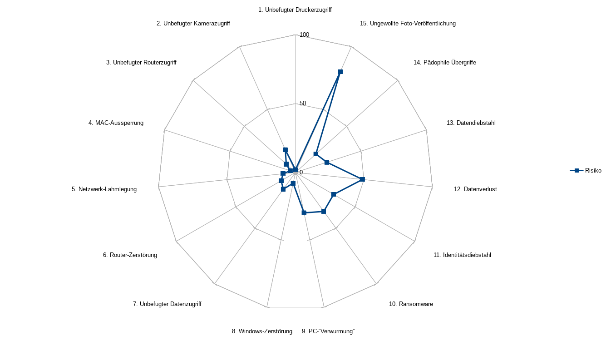

# Risiken

a. Ein Nachbar (oder dessen verwurmter PC) könnte die WEP-WLAN-Verschlüsselung knacken. Dadurch ergeben sich die folgenden Risiken:
    1. Der Drucker könnte von Unbefugten verwendet werden. Das bringt diesen zwar nichts, könnte aber Papier und Toner bzw. Tinte verschwenden und das Gerät abnutzen.
    2. Die beiden installierten Kameras könnten zur Spionage verwendet werden. Das bedeutete einerseits die Verletzung der Privatsphäre, andererseits könnte dies auch für Einbrüche nützlich sein, da man so herausfinden kann, wann niemand zu Hause ist.
    3. Besteht erst einmal Zugriff auf den Router und erlaubt dieser Konfiguration über WLAN, könnte ein Angreifer auf sämtliche ungeschützten Freigaben im Netzwerk zugreifen.
    4. Weiter könnten Geräte per MAC-Sperre aus dem Netzwerk ausgeschlossen werden.
    5. Das Netzwerk könnte so gänzlich lahmgelegt werden.
    6. Der Router könnte durch Einspielung einer manipulierten Firmware gar zerstört werden.
    7. Über das gekaperte Netzwerk könnten trojanische Pferde eingespeist werden, die dann Remote-Kontrolle über die Systeme übernehmen könnten. Dadurch könnten private Daten abgegriffen und/oder gelöscht werden.
    8. Die Windows-Intallationen könnten unwiderruflich zerstört werden.
b. Onkel Özutöcks Laptop könnte verwurmt sein.
    9. Die Programme, die er so auf die PCs überspielt, könnten dadurch ebenfalls verwurmt sein.
c. Es ist nirgends die Rede von Antiviren-Software. Doch Windows ist aufgrund seiner Verbreitung ein beliebtes Ziel für Entwickler von Schadsoftware. Von Datensicherung ist auch nirgends die Rede.
    10. Mit sogenannter Ransomware könnten private Daten verschlüsselt werden, sodass sie nur durch eine Lösegeldzahlung entschlüsselt werden könnten. Es droht Datenverlust oder finanzieller Schaden.
    11. Trojanische Pferde oder Würmer könnten aktive Logins (über Session-Cookies) übernehmen und auf verschiedenen Benutzerkonti straftrechtlich relevante Informationen verbreiten (Facebook, Twitter) oder im schlimmsten Fall sogar auf das Online-Banking zugreifen. Sind die Passwörter im Klartext abgespeichert, können sie alle problemlos abgegriffen werden.
    12. Bei einem plötzlichen Festplatten-Crash gehen die darauf gespeicherten Daten unwiderruflich verloren. Daten könnten auch aus Versehen gelöscht werden. Wird dies lange nicht bemerkt, kann die Wiederherstellung der Daten scheitern.
d. Arbeitet Herr Meier zu Hause, dürften vertrauliche Daten der Bundesverwaltung betroffen sein.
    13. Es könnten vertrauliche Daten oder gar Staatsgeheimnisse an Unbefugte gelangen. Herr Meier könnte im schlimmsten Fall der Veruntreuung oder gar des fahrlässigen Landesverrats angeklagt werden. (Die Verwendung von WEP zur Sicherung eines WLAN ist fahrlässig.)
e. Die jüngste Tochter Dora (12) kann vielleicht die Risiken nicht abschätzen, die ein Smartphone mit Kamera mit sich bringen.
    14. Pädophile könnten sie nach Bildern und nach ihrer Adresse fragen, wodurch sie direkt gefährdet werden könnte.
    15. Bilder, die nicht für die Öffentlichkeit bestimmt sind, könnten auf soziale Medien gelangen, wo sie kaum mehr gelöscht werden könnten.

## Risikogewichtung

Risiko                                Häufigkeit  Schadensausmass  Risiko
------------------------------------ ----------- ---------------- -------
1. Unbefugter Druckerzugriff                   1                1       1
2. Unbefugter Kamerazugriff                    1                3       3
3. Unbefugter Routerzugriff                    2                1       1
4. MAC-Aussperrung                             1                1       1
5. Netzwerk-Lahmlegung                         1                1       1
6. Router-Zerstörung                           1                1       1
7. Unbefugter Datenzugriff                     1                3       3
8. Windows-Zerstörung                          2                2       4
9. PC-"Verwurmung"                             3                2       6
10. Ransomware                                 2                3       6
11. Identitätsdiebstahl                        2                3       6
12. Datenverlust                               3                2       6
13. Datendiebstahl                             1                3       3
14. Pädophile Übergriffe                       1                3       3
15. Ungewollte Foto-Veröffentlichung           3                2       6

## Übersicht Risiken

# Massnahmen

## Budget bis CHF 500

a. Risiken 1-8 sind zwar nicht die grössten, können aber einfach gelöst werden, indem ein WLAN-Router mit WPA2 installiert wird. Es wird ein schwer knackbares Passwort eingesetzt, dass nur den Eltern bekannt ist, und dass sie bei allen Geräten selber eingeben müssen. Kosten: CHF 100.-
b. Risiko 9, PC-Verwurmung: Der Onkel Özutöck soll geschult werden, sodass er Programme nicht mehr von seinem Laptop auf andere Computer überträgt, sondern sie jeweils in einer aktuellen Version direkt vom Anbieter herunterlädt und, falls möglich, die heruntergeladene Version gegen einen Hash-Wert auf Integrität überprüft. Kosten: CHF 100.-
c. Risiko 10, Ransomware und Risiko 12, Datenverlust: Mittels Backup-Lösung von Windows und einer externen Festplatte soll eine einfache Datensicherung eingerichtet werden. Kosten: CHF 100.-
d. Risiko 11, Identitätsdiebstahl: Die Webbrowser sollen so eingestellt werden, dass Session-Cookies beim Beenden des Browsers immer automatisch gelöscht werden. Kosten: CHF 100.-
e. Risiko 15, Ungewollte Foto-Veröffentlichung: Ein Fachmann soll der ganzen Familie eine einstündige Schulung geben, wie man mit Fotos umgehen soll: Kosten: CHF 100.-

### Risikosituation nach diesen Massnahmen

- Die Risiken 1-8 (unsicheres WLAN) sollten durch die Umstellung von WEP auf WPA2 nahezu eliminiert worden sein.
- Risiko 9 (Özutöcks potenziell verwurmte Software) sollte durch eine entsprechende Schulung erheblich gemindert worden sein.
- Die Risiken 10 (Ransomware) und 12 (Datenverlust) werden durch die einfache Backup-Lösung stark gemindert.
- Das Risiko 11 (Identitätsdiebstahl) wurde durch die Schulung etwas abgemindert. Es ist aber möglich, dass die Massnahmen aus Bequemlichkeit wieder rückgängig gemacht werden.
- Das Risiko 15 (ungewollt veröffentliche Fotos) wird durch die Schulung der Familie gemindert.

Risiko                                Häufigkeit  Schadensausmass  Risiko
------------------------------------ ----------- ---------------- -------
9. PC-"Verwurmung"                             1                2       2
10. Ransomware                                 2                1       2
11. Identitätsdiebstahl                        1                3       3
12. Datenverlust                               2                1       3
13. Datendiebstahl                             1                3       3
14. Pädophile Übergriffe                       1                3       3
15. Ungewollte Foto-Veröffentlichung           1                2       2

## Budget bis CHF 1500

a. Folgende, bereits oben aufgeführte Massnahmen für bis zu CHF 500.- sollen auch für ein Budget von CHF 1500.- umgesetzt werden:
    1. Installation eines neuen WLAN-Routers mit WPA2 und sicherem, bei den Eltern aufbewahrtem Passwort: CHF 100.-
    2. Schulung von Onkel Özutöck: CHF 100.-
    3. Sichere Konfiguration der Webbrowser: CHF 100.-
    4. Schulung der Familie bezüglich Umgang mit Fotografien: CHF 100.-
b. Risiko 10 (Ransomware) und Risiko 12 (Datenverlust) sollen durch die Installation eines automatischen Backup-Systems mittels NAS implementiert werden. Kosten: CHF 1000.-
c. Risiko 10 (Ransomware) und Risiko 11 (Identitätsdiebstahl) Auf dem Eltern-PC soll die Microsoft-eigene Antivirensoftware durch eine bessere Antiviren-Lösung ersetzt werden: CHF 100.-

### Risikosituation nach diesen Massnahmen

- Die Risiken 1-8 (unsicheres WLAN) sollten durch die Umstellung von WEP auf WPA2 nahezu eliminiert worden sein.
- Risiko 9 (Özutöcks potenziell verwurmte Software) sollte durch eine entsprechende Schulung erheblich gemindert worden sein.
- Die Risiken 10 (Ransomware) und 12 (Datenverlust) werden durch die NAS-Backup-Lösung stark gemindert.
- Das Risiko 11 (Identitätsdiebstahl) wurde durch die Schulung etwas abgemindert. Es ist aber möglich, dass die Massnahmen aus Bequemlichkeit wieder rückgängig gemacht werden.
- Die Risiken 9 (PC-"Verwurmung"), 10 (Ransomware) und 11 (Identitätsdiebstahl) werden durch die Installation einer hochwertigeren Antiviren-Lösung noch weiter gemindert.
- Das Risiko 15 (ungewollt veröffentliche Fotos) wird durch die Schulung der Familie gemindert.

Risiko                                Häufigkeit  Schadensausmass  Risiko
------------------------------------ ----------- ---------------- -------
9. PC-"Verwurmung"                             1                1       1
10. Ransomware                                 1                1       1
11. Identitätsdiebstahl                        1                3       3
12. Datenverlust                               1                1       1
13. Datendiebstahl                             1                3       3
14. Pädophile Übergriffe                       1                3       3
15. Ungewollte Foto-Veröffentlichung           1                2       2

## Budget ab CHF 1500

a. Folgende, bereits oben aufgeführte Massnahmen sollen auch für das Budget ab CHF 1500.- umgesetzt werden (Kosten: CHF 1400.-):
    1. Installation eines neuen WLAN-Routers mit WPA2 und sicherem, bei den Eltern aufbewahrtem Passwort: CHF 100.-
    2. Schulung von Onkel Özutöck: CHF 100.-
    3. Sichere Konfiguration der Webbrowser: CHF 100.-
    4. Schulung der Familie bezüglich Umgang mit Fotografien: CHF 100.-
    5. Installation eines NAS mit Backup-Lösung: CHF 1000.-
b. Risiko 9 (PC-"Verwurmung"): Sämtliche PCs und Laptops (auch derjenige von Onkel Özutöck) sollen eine hochwertige Antiviren-Lösung erhalten. Kosten: CHF 500.-
c. Risiko 11 (Identitätsdiebstahl): Die ganze Familie soll im Passwort-Management geschult werden. Dazu wird ein Passwort-Manager installiert und die Familie in dessen Gebrauch geschult. Sämtliche Passwörter werden durch sichere, generierte Passwörter ersetzt, was sehr arbeitsintensiv ist, zumal zunächst sämtliche verwendeten Passwörter katalogisiert werden müssen. Kosten: CHF 1000.-
d. Die Risiken 9 (PC-"Verwurmung"), 10 (Ransomware) und v.a. 13 (Datendiebstahl) sollen durch die Installation einer vorgelagerten Firewall weiter gemindert werden. Diese wird von einem Sicherheits-Spezialisten konfiguriert. Kosten: CHF 2000.-

Die Gesamtkosten belaufen sich auf CHF 4900.-

### Risikosituation nach diesen Massnahmen

- Die Risiken 1-8 (unsicheres WLAN) sollten durch die Umstellung von WEP auf WPA2 nahezu eliminiert worden sein.
- Risiko 9 (Özutöcks potenziell verwurmte Software) sollte durch eine entsprechende Schulung und einer Antiviren-Lösung erheblich gemindert worden sein.
- Die Risiken 10 (Ransomware) und 12 (Datenverlust) werden durch die NAS-Backup-Lösung stark gemindert.
- Das Risiko 11 (Identitätsdiebstahl) wurde durch den konsequenten Einsatz eines Passwort-Managers, die sichere Konfiguration des Webbrowsers und die Schulung praktisch eliminiert.
- Die Risiken 9 (PC-"Verwurmung"), 10 (Ransomware) und 11 (Identitätsdiebstahl) werden durch die Installation einer hochwertigeren Antiviren-Lösung noch weiter gemindert.
- Die Risiken 9 (PC-"Verwurmung"), 10 (Ransomware) und v.a. 13 (Datendiebstahl) sind mit der Firewall auf ein Minimum reduziert worden.
- Das Risiko 15 (ungewollt veröffentliche Fotos) wird durch die Schulung der Familie gemindert.

Risiko                                Häufigkeit  Schadensausmass  Risiko
------------------------------------ ----------- ---------------- -------
12. Datenverlust                               1                1       1
14. Pädophile Übergriffe                       1                3       3
15. Ungewollte Foto-Veröffentlichung           1                2       2

# Fazit

Die Verwundbarkeiten in dieser Fallstudie gehen v.a. auf zwei Faktoren zurück:

1. Einsatz veralteter Sicherheits-Technologien (WEP)
2. Falsches, unbedachtes Verhalten
    a. im Umgang mit Passwörtern
    b. im Umgang mit Datensicherung
    c. im Umgang mit persönlichen Daten, z.B. Fotos

Viele Risiken konnten durch das Ersetzen der WEP-Verschlüsselung durch eine zeitgemässere Technologie stark vermindert werden, ohne dass dabei grosse Kosten entstanden sind. Der ständige Zugewinn an Rechenkapazität zwingt einen immer wieder zum Austausch der eingesetzten Verschlüsselungstechnologie.

Einige Risiken (Identitätsdiebstahl, ungewollte Foto-Veröffentlichung) konnten mittels Schulungen gemindert werden. Dies funktioniert aber nur, wenn die dort eingeübten Verhaltensregeln konsequent eingehalten werden.

Wer streng vertrauliche Daten zu Hause bearbeiten will, braucht eine professionelle Sicherheits-Infrastruktur, sprich eine vorgelagerte Firewall, die von einem Profi konfiguriert werden soll. Dies könnte jedoch zu Komfort-Einschränkungen führen, zumal gewisse Dienste bzw. Ports ganz geschlossen werden sollten. Als noch tiefgreifendere Massnahme käme die Aufteilung des Netzwerkes in zwei Segmente in Betracht.

Risiken wie Datenverlust und Pädophilie können durch IT-Massnahmen nicht komplett eliminiert werden. Hardware kann kaputt gehen, und Pädophile gab es auch schon, bevor es Computer gab. Hier ist Vorsicht ebenso wichtig wie eine entsprechende technische Infrastruktur.
